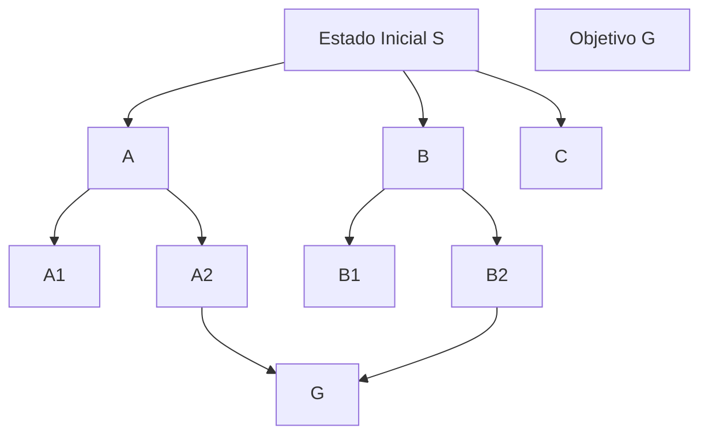

# Introduccion a la inteligencia artificial

¿Qué es la IA?

Es una rama de la informática que estudia sistemas capaces de realizar una simulación del pensamiento humano.

Un sistema es inteligente si es las respuestas tienen racionalidad

| Humano   | IA                      |
| :------- | :---------------------- |
| aprender | machine learnig         |
| ver      | vision artificial       |
| escuchar | reconocimiento de voz   |
| hablar   | sintesis de voz         |
| decidir  | razonamiento automatico |

#### Historia

| 1943                                 | 1950                                             |
| :----------------------------------- | :----------------------------------------------- |
| Primer modelo de neurona Warren...   | Alan turin, cuestiona las maquinas pueden pensar |
| 1958                                 | 1960                                             |
| Inicio de la ia                      | Primeros programas inteligentes                  |
| 1970                                 | 1980                                             |
| pausa de ia datos de poco poder      | Machine learning                                 |
| 2010                                 | 2012                                             |
| deep learning, reconocimiento facial | ia generativa, chatgpt                           |

# Fundamentos de la inteligencia artificial

### Objetivos

    - identiicar: los conponentes basicoas de un sistema inteligente
    - diseñar un agente inteligente
    - representar problemas para ser resueltos mediante IA
    - comprenr como una IA toma decisiones
    - analizar entorno y comportaminetos de los agentes

## Agente

Es un programa a informatico, con autonomia, razona, toma decisiones, ejecuta acciones, orinetada a un objetivo

Características de un agente:

- **Percepción:** obtiene información del entorno
- **Procesamiento:** analiza los datos recibidos
- **Acción:** realiza movimientos o decisiones basadas en el análisis
- **Racionalidad:** busca maximizar su medida de desempeño

## LLM

large lenguaje model
Modelo de lenguaje, tiene que aptender, entrena con cantidades masivas de texto

## Componentes basicos de un sistema inteligente

    - sensores de entrada (recibe informacion)
    - base de conocimientos (alamacena informacion)
    - motor de inferencia (es el cerebro de sistema)
    - memoria o  BD
    - componetes de aprendizaje (perimite que el sistema mejore)
    - actudores de salida (se ejeciar las decissiones)

### Estructura matematica

> y=f(x)

x = variable de entrada, caracteristicas, datos opistas, que se le da a un sistema, texto, nuneros, pixeles de una imagen o frecuencia de audio

y = varuiable de salid; es la prediccion, el resultado que queremos que la maquina adivine

f = la funcion en el medio,es el algoritmo de la IA fucion vacia o con valores aleatorios

#### Sistemade aprobacion de creditos bancarios

| Cliente    | x1 Ingreso Mensual (USD) | x2 Puntaje de Crédito | x3 Edad | y Pagó el Crédito |
| :--------- | :----------------------- | :-------------------- | :------ | :---------------- |
| **Juan**   | 4000                     | 85                    | 35      | 1                 |
| **María**  | 8500                     | 90                    | 42      | 1                 |
| **Pedro**  | 3500                     | 30                    | 22      | 0                 |
| **Ana**    | 12000                    | 40                    | 28      | 0                 |
| **Carlos** | 3000                     | 88                    | 31      | ?                 |

> formula

x2 = 88
f(x) = % alta 0.94 = 94%

Calidad de datos

80% de un proyectos de IA
no es el codigo del algoritmo
si no es limnpiar y asegurar que la tabla no tenga errores

Una empresa de transporte urbano tipo una app de taxis, como yango, o una red de buses moderna, los contrata para diseñar un modelo predictivo que solucione uno de los siguientes problemas de su negocio
a) predecir el tiempo de espera (min) que le tomara a un pasajero tomar el transporte en hora pico
b) predecir si un conductor o empleado va a renunciar a la empresa el proximo mes

#### Problema a) Predicción de Tiempo de Espera en Hora Pico (Distancia A-B, Tráfico, Día, Demanda y Conductores)

| x1 Distancia A-B (km) | x2 Tráfico (1-5) | x3 Día Semana | x4 Demanda Pasajeros | x5 Conductores Disponibles | y Tiempo Espera (min) |
| :-------------------- | :--------------- | :------------ | :------------------- | :------------------------- | :-------------------- |
| 3.2                   | 3                | Lunes         | 450                  | 25                         | 12                    |
| 1.1                   | 4                | Lunes         | 480                  | 24                         | 18                    |
| 7.5                   | 2                | Viernes       | 520                  | 20                         | 22                    |
| 12.0                  | 5                | Viernes       | 610                  | 18                         | 35                    |
| 0.8                   | 2                | Miércoles     | 200                  | 30                         | 5                     |

**Variables de entrada (x):** distancia parada A a B, nivel de tráfico, día de la semana, demanda de pasajeros, conductores disponibles
**Variable de salida (y):** tiempo espera en minutos

Nota: en la Predicción de Tiempo de Espera se considera la distancia exacta del punto A al punto B (x1), el nivel de tráfico (x2) que afecta directamente la velocidad de desplazamiento, el día de la semana (x3) que determina patrones de demanda, la demanda actual de pasajeros (x4) y la disponibilidad de conductores (x5). Estos factores combinados permiten estimar el tiempo de asignación y espera del usuario.

#### Problema b) Predicción de Renuncia de Conductor

| Conductor | x1 Meses en Empresa | x2 Ingresos Promedio USD | x3 Evaluación (1-5) | x4 Horas/Semana | y Renunció |
| :-------- | :------------------ | :----------------------- | :------------------ | :-------------- | :--------- |
| Carlos    | 6                   | 1200                     | 4.2                 | 48              | 0          |
| Miguel    | 3                   | 800                      | 2.1                 | 35              | 1          |
| Ana       | 12                  | 1500                     | 4.8                 | 50              | 0          |
| Roberto   | 2                   | 700                      | 1.9                 | 20              | 1          |
| Laura     | 8                   | 1300                     | 4.5                 | 45              | ?          |

**Variables de entrada (x):** antigüedad, salario, satisfacción, disponibilidad
**Variable de salida (y):** renuncia sí/no (1/0)
**Calidad de datos importante:** encuestas, historial de faltas, rotación histórica

Justificación de cada variable:

- Problema a) Predicción de Tiempo de Espera en Hora Pico:
  - x1 Distancia A-B (km): la distancia entre origen y destino influye en la asignación y el tiempo total de atención.
  - Ruido de datos / Valores basura: puede introducirse en cualquier variable pero suele detectarse frecuentemente en x1 (Distancia A-B). La distancia puede variar por fallas técnicas (GPS, registro) o error humano al ingresar datos, generando outliers o valores inconsistentes que afectan el modelo.
  - x2 Tráfico (1-5): a mayor tráfico, más lento es el desplazamiento y mayor suele ser el tiempo de espera.
  - x3 Día Semana: el comportamiento de la demanda cambia según el día; por ejemplo, viernes suele tener más congestión que miércoles.
  - x4 Demanda Pasajeros: refleja cuántos usuarios están solicitando servicio; mayor demanda normalmente aumenta la espera.
  - x5 Conductores Disponibles: indica la capacidad de oferta; menos conductores disponibles incrementan el tiempo de espera.
  - y Tiempo Espera (min): variable objetivo que queremos predecir.

Ejemplo extra: en un caso con 12.0 km, tráfico 5, viernes, 610 pasajeros de demanda y 18 conductores disponibles, el tiempo de espera esperado será mayor que en un caso con 0.8 km, tráfico 2, miércoles, 200 pasajeros y 30 conductores.

- Problema b) Predicción de Renuncia de Conductor:
  - x1 Meses en Empresa: antigüedad correlaciona con probabilidad de rotación.
  - x2 Ingresos Promedio USD: salario influye directamente en la satisfacción y decisión de quedarse.
  - Ruido de datos / Valores basura: puede presentarse en una variable de decisión como x2 (Ingresos Promedio USD), por errores de registro o datos mal digitados, y afectar la predicción.
  - x3 Evaluación (1-5): mide desempeño y posiblemente reconocimiento; baja evaluación puede asociarse a mayor estrés o insatisfacción.
  - x4 Horas/Semana: carga laboral excesiva puede aumentar probabilidad de renuncia.
  - y Renunció: variable objetivo binaria (1: renunció, 0: no).

#### Un robot debe decidir si apreuba o un prestamo de libros

    - Sensor: Recibe (nombre, libros_prestado) - ("juan", 40)
    - Base de conocimiento: (libros prestados <= 3) ? "aprobado" : "rechazar"
    - Motor de inferencia: 4>3 => rechazado
    - memoria: usuario: juan; resultado: rechazado

##### Ejercicios planteados (ejemplos estructurados)

1. Cajero automático (depósitos en otras monedas)
   - Sensores: entrada (usuario_id, monto, moneda_origen, moneda_destino)
   - Base de conocimiento: tipos_cambio, límites_cuenta, comisiones
   - Motor de inferencia: validar saldo y límites -> convertir moneda usando tipo_cambio -> aplicar comisión -> actualizar saldo
   - Memoria: transacción {usuario_id, monto_origen, monto_destino, tasa, comisión, estado}

2. Semáforo inteligente (detectar animales que crucen)
   - Sensores: cámaras, sensores de movimiento, sensores térmicos
   - Base de conocimiento: modelos_vision_animales, reglas_seguridad, horarios_peatonales
   - Motor de inferencia: detectar objeto -> clasificar (animal/peatón/vehículo) -> si animal en zona_crítica entonces priorizar paso y señalizar -> ajustar tiempos de luz
   - Memoria: eventos {timestamp, tipo_objeto, acción_tomada}

3. Sistema de asistencia y verificación de notas (estudiante)
   - Sensores: entrada (estudiante_id, actividad, nota_obtenida)
   - Base de conocimiento: umbrales_aprobacion, historial_notas, reglas_promedio
   - Motor de inferencia: actualizar historial -> calcular promedio -> comparar con umbral -> generar estado (aprobado/requiere_recuperacion)
   - Memoria: registro_notas {estudiante_id, actividad, nota, promedio_actual, estado}

4. Robot de limpieza (tareas programadas por hora en una casa)
   - Sensores: sensores de posición, mapa de la casa, detectores de suciedad, estado_batería
   - Base de conocimiento: horarios_programados, zonas_prioritarias, restricciones (habitaciones cerradas)
   - Motor de inferencia: comprobar hora_actual y nivel_suciedad -> planificar ruta óptima -> ejecutar limpieza -> si batería baja regresar a base
   - Memoria: log_tareas {hora, zona, duración, resultado, nivel_batería}

# Tecnicas de busqueda

Compreder como un agente inteligente encuentra soluciones explorando un conjunto de estados mediante algoritmos de busqueda y seleccionar la estrategia mas adecuada, segun el problema dado

La idea principal es la siguiente:

    - Estado inicial
    - Explorar posibilidades
    - Encontrar la solucion
    - Estado objetivo

Por que es importante ???
Muchos problemas de IA son problemas de busqueda -
Por ejemplo:

    - GPS, Robots, Chatbots, planificacion de rutas

Ejemplo:

    - Tu casa a la universidad (muchas rutas)
    - Formulacion del problema
        - Estado inicial: punto de partida
        - Estado objetivo:  meta que queremos alcanzar
        - Acciones: operaciones disponibles
        - transicion: como se cambia de estado a otro
        - costo: precio por accion realizada

Arbol de busqueda
Ejemplo de árbol de búsqueda (Mermaid):

Tipos de busqueda

    - Tecnicas de busqueda
        - busqueda no informada: BFS, DFS, consto uniforme, bidireccional
        - busqueda informada: Greedy,
